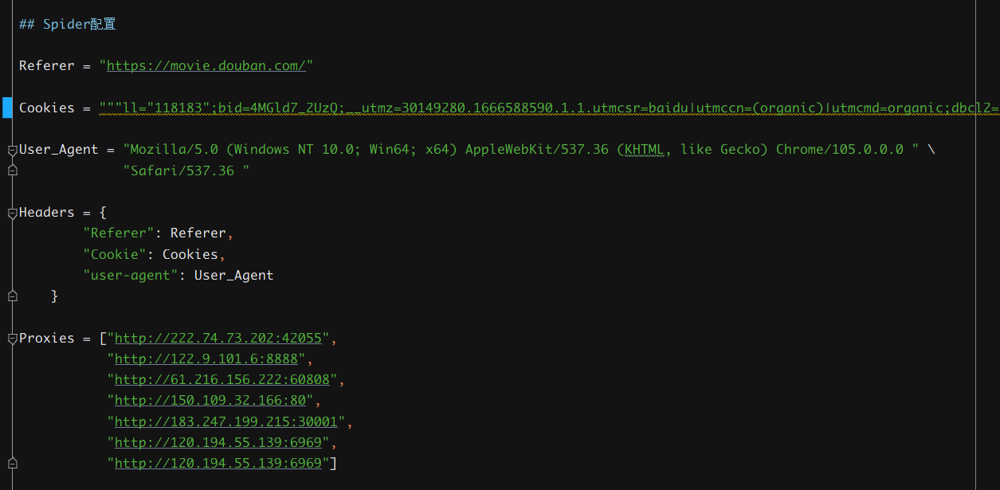
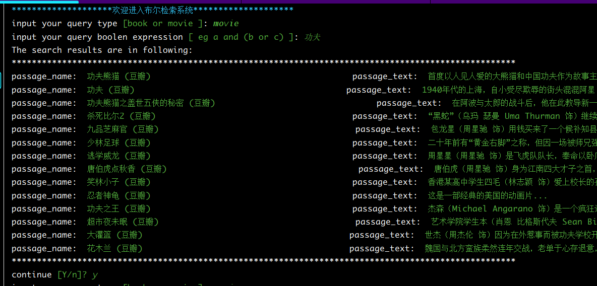
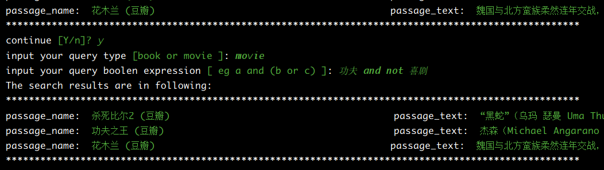
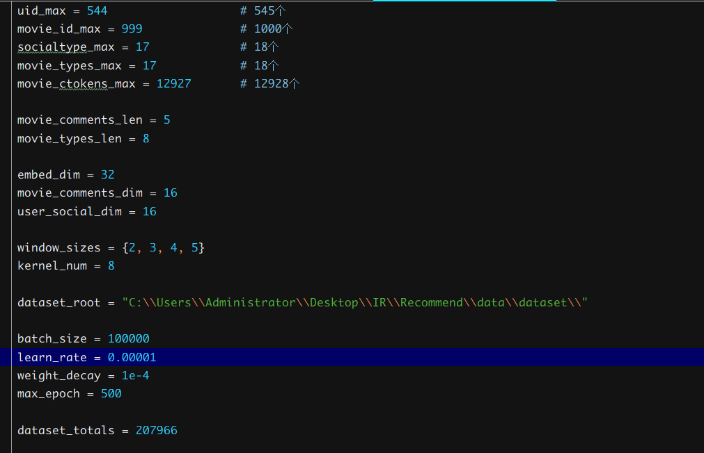
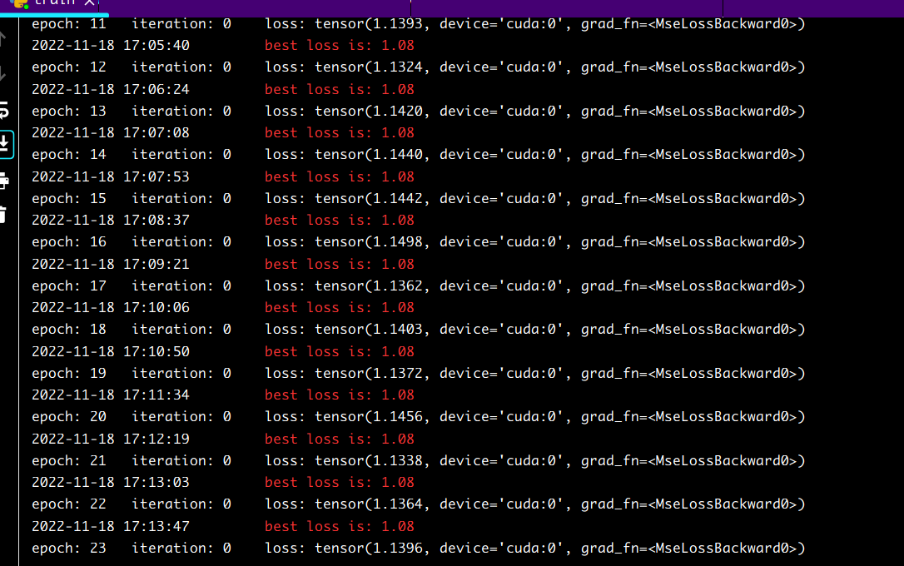

# 实验1 信息获取与检索分析

<center>
柯志伟  PB20061338  &nbsp;
左丰瑞  PB20061337  &nbsp;
刘一鸣  PB20050973  &nbsp;
</center>

---

## 实验题目

&nbsp;&nbsp;&nbsp;&nbsp;信息获取与检索分析


## 实验要求

&nbsp;&nbsp;&nbsp;&nbsp;实验将分为`爬虫`、`检索`、`个性化检索(推荐)`三个阶段

### 爬虫
&nbsp;&nbsp;&nbsp;&nbsp;针对给定的电影、书籍 ID，爬取其豆瓣主页，并解析其基本信息。以下图电影数据为例，其主页包含导演编剧等基本信息、剧情简介、演职员表、相关视频图片、获奖情况等。具体如下:

- 对于电影数据，至少爬取其基本信息、剧情简介、演职员表
- 对于书籍数据，至少爬取其基本信息、内容简介、作者简介
- 爬虫方式不限，网页爬取和 API 爬取两种方式都可，介绍使用的爬虫方式工具
- 针对所选取的爬虫方式，发现并分析平台的反爬措施，并介绍采用的应对策略
- 针对所选取的爬虫方式，使用不同的内容解析方法，并提交所获取的数据
- 该阶段无评测指标要求，在实验报告中说明爬虫(反爬)策略和解析方法即可

### 布尔检索
&nbsp;&nbsp;&nbsp;&nbsp;实现电影、书籍的 bool 检索 。首先基于阶段一爬取的电影和书籍简介等数据，自行选择并提取需要使用的字段信息。以电影数据为例，对于剧情简介字段，将剧情简介视作一个文档，对其进行分词、去停用词处理，将剧情简介表征为一系列关键词集合；同时对于电影类型字段，如“剧情”、“犯罪”，可直接将其加入电影表征后的关键词集。具体如下:
- 对一阶段中爬取的电影和书籍数据进行预处理，将文本表征为关键词集合
- 在经过预处理的数据集上建立倒排索引表𝑺，并以合适的方式存储生成的倒排索引文件
- 对于给定的 bool 查询 $Q_{bool}$(例如 动作 and 剧情)，根据你生成的倒排索引表𝑺，返回符合查询规则$Q_{bool}$的电影或和书籍集合$A_{bool}$ = {$A_{1}^{bool}$,$A_{2}^{bool}$,...}，并以合适的方式展现给用户(例如给出电影名称和分类或显示部分简介等)


### 个性化推荐
&nbsp;&nbsp;&nbsp;&nbsp;自行划分训练集与测试集，在测试集上为用户对书籍或电影的评分进行排序，并用 NDCG 对自己的预测结果进行评分和进一步分析。书籍和电影选一个完成。具体如下:
- 数据划分,按一定比例划分某些(或全部)用户的评分。用于预测的数据为抹去了打分分值的数据，即:用户与这些电影/书籍交互过，但(假装)不知道得分
- 评分排序,对上面抹去分值的对象进行顺序位置预测，即:若以升/降序排序用户的所有评价，那这些数据应该放在第几位。将预测出的对象顺序与实际的顺序进行比较，并用NDCG 评估预测效果
- 结果分析,根据上面的得分对自己的方法和结果进行一定分析，若采用了不同的方法，也可以比较不同方法的结果。同时你们需要保留预测结果和过程以备助教查验

## 实验过程

### 爬虫

&nbsp;&nbsp;&nbsp;&nbsp;使用实验提供的资源列表,通过python的requests库，从豆瓣逐一请求资源并下载到本地

#### 反爬机制
&nbsp;&nbsp;&nbsp;&nbsp;**本次实验中发现豆瓣反爬利用了以下信息:**
- 请求的user-agent信息
- cookies信息
- referer信息
- 请求速度(下载太快会封ip)


&nbsp;&nbsp;&nbsp;&nbsp;**分别采用以下方式进行反爬:**
- 添加浏览器的user-agent头信息
- 添加登录豆瓣账号后的cookies信息
- 针对每个请求设置上一个网页的网址为referer
- 建立代理池进行,同时限制下载的速度

&nbsp;&nbsp;&nbsp;&nbsp;**爬虫的配置信息如下,详细见**`IR\Corpus\config.py`


&nbsp;&nbsp;&nbsp;&nbsp;**页面保存位置**
- 电影 `IR\Corpus\data\htmls\movies`
- 书籍 `IR\Corpus\data\htmls\books`


&nbsp;&nbsp;&nbsp;&nbsp;**失效页面 (解析时无法提取出有效内容，发现页面是无效的)**
- 电影 `1295428 1305088 1309046  1310174`
- 书籍 `1025723 1079509 1803022  1903968  1918734  4112874`


#### 数据解析
&nbsp;&nbsp;&nbsp;&nbsp;**在本地解析电影书籍的所需信息,具体解析信息及方法、信息保存方式如下**:
- 解析信息
  ```txt
  电影: 
       基本信息(导演,编剧,类型,制片国家/地区,语言,上映日期,片长,又名,IMDb), 
       内容介绍
       演员信息
  书籍: 
       基本信息(作者,出版社,出版年,页数,定价,装帧,ISBN)
       内容介绍
       作者介绍
  ```
- 解析方式

  使用python的`beautifulsoup`解析html页面,对于难处理的数据使用`re正则表达式`做进一步处理,包装了一个使用于本次实验的一个解析解析器,为每一个待解析的数据创建一个解析器,关于电影信息的解析器如下,详细见`IR\Corpus\filter.py`:
  ```python
  ## 创建电影信息的解析器
  ##  基本信息(导演,编剧,类型,制片国家/地区,语言,上映日期,片长,又名,IMDb)
  m_director = Filter(["导演:"], None, ("id", "info"), ("name", "span"))
  m_writer = Filter(["编剧:"], None, ("id", "info"), ("name", "span"))
  m_type = Filter(None, None, ("id", "info"), ("property", "v:genre"))
  m_made_country = Filter(None, (r'制片国家/地区:</span>(.*?)<br/?>',0), ("id", "info"))
  m_language = Filter(None, (r'语言:</span>(.*?)<br/?>', 0), ("id", "info"))
  m_show_time = Filter(None, None, ("id", "info"), ("property", "v:initialReleaseDate"))
  m_duration = Filter(None, None, ("id", "info"), ("property", "v:runtime"))
  m_alias = Filter(None, (r'又名:</span>(.*?)<br/?>', 0), ("id", "info"))
  m_imdb = Filter(None, (r'IMDb:</span>(.*?)<br/?>', 0), ("id", "info"))
  m_title = Filter(None,None,("name","title"))
  ###  内容介绍
  m_synopsis = Filter(None, None, ("id", "link-report"), ("property", "v:summary"))
  ###  演员信息
  m_actors = Filter(None, None, ("class", "celebrity"), ("class", "name"), ("name", "a"))
  ```
- 信息保存
  对解析出的所有页面的同一项信息保存到单个txt文件中, 具体见`IR\Corpus\data`下,另外将所有结果汇总保存到xls文件中, 具体见`IR\Corpus\豆瓣电影.xls`、`IR\Corpus\豆瓣书籍.xls`
  


### 布尔检索

#### 建立语料库
&nbsp;&nbsp;&nbsp;&nbsp;语料库采用将文章逐个加入的方式创建, 同时为后续的布尔检索以及搜索结果展示需要维护各个词项的倒排索引, 语料库中所有的文章名,文章编号, 文章概要, 所有词项以及对应编号, 同时维护preload域用于加载预先创建的语料库对象

&nbsp;&nbsp;&nbsp;&nbsp;**构建动态语料库的流程如下(以一篇文章加入为例)**

- 保存输入的文章名以及概要,建立并维护文章编号
- 对输入的词项使用`jieba分词`并去除`停用词`,`标点符号`后获取所有词项,建立词项编号并维护
- 动态创建词项的倒排索引并维护,采用python字典结构,可动态增加,同时维护词项频率供后续检索优化

&nbsp;&nbsp;&nbsp;&nbsp;由于构建语料库对象需要耗费较多时间,每次构建后使用python的pickle模块保存,下次使用直接load即可,详细内容见`IR\Corpus\corpus.py`

#### 解析布尔表达式

&nbsp;&nbsp;&nbsp;&nbsp;用户查询输入的布尔表达式的解析是通过`yacc` 和 `lex`实现的。根据事先规定的格式对布尔表达式进行语法分析，并在产生式中添加相关的语义动作，实现在规约的过程中完成倒排表的合并。

&nbsp;&nbsp;&nbsp;&nbsp;**布尔表达式语法规则:**
- 支持输入`not/NOT`、`and/AND`、`or/OR`进行检索，同时将上述词作为保留字，不能检索这些关键字。
  - 优先级关系为`not/NOT > and/AND > or/OR`
  - 其中我们对`not/NOT`的使用做了一点微小的限制，即不能单独使用`not/NOT`搜索(例如:`not 小说`这样的表达式是不被允许的)，它必须配合`and/AND`来使用(例如:`not 小说 and 历史`)。这样做是有意义的，因为用户一般使用`not`仅是为了从一个搜索结果中筛选掉一些无关的内容，而单纯的`not`搜索会返回大量文档，这不是用户想看到的。
- 表达式中支持输入括号(中文括号和英文括号皆可)，并且支持任意的括号嵌套。

&nbsp;&nbsp;&nbsp;&nbsp;**倒排表**

&nbsp;&nbsp;&nbsp;&nbsp;实验中，我们用python中的`列表`作为倒排表的数据结构。

&nbsp;&nbsp;&nbsp;&nbsp;倒排表的每个表项中除了文档id号外，还包含一个记录`频率`的位置。`频率`的意义是:
```txt
若倒排表中仅有一个文档，则频率表示用户查询的所有词项(通过`and`和`or`连接的所有词)在该文
档中出现的次数之和。例如: 用户查询`小说 and (历史 or 爱情)`，则`频率`为`小说`、`历史`、
`爱情`这三个词项在该文档中出现的次数之和
```
&nbsp;&nbsp;&nbsp;&nbsp;`频率`会在倒排表合并过程中一并计算。我们用频率表征一个文档的和用户查询内容的相关性，在合并完倒排表后我们会根据每个文档`频率`大小按照降序进行排序，再呈现给用户。我们这么做的意义是:假定用户输入的每一个搜索词项(除了`not`连接的词项)都是用户感兴趣的，并且假定这些词都是同等重要的，那么文章包含这些词越多，则其重要性越大，应该排在更前面。考虑到本次实验中文档长度都差不多且普遍较短，因此忽略掉了文档长度的影响，只考虑词频。

&nbsp;&nbsp;&nbsp;&nbsp;**跳表指针**

&nbsp;&nbsp;&nbsp;&nbsp;​我们在实验中采用固定长度的跳表指针，即在每隔根号p的距离设置一个跳表指针(其中p为倒排表长度)。考虑到倒排表的数据结构是列表，这相当于顺序表而非链表，因此实际上不需要在每个表项中增加跳表指针元素。由于跳表指针长度固定，在合并的过程中只需要记下根号p的值，然后在每个根号p的位置上都进行跳表操作即可。

#### 检索结果
&nbsp;&nbsp;&nbsp;&nbsp;使用语料库中的文章列表及文本内容,将检索出的文章名,并将概要内容显示给用户
&nbsp;&nbsp;&nbsp;&nbsp;效果如下:






### 个性化推荐

&nbsp;&nbsp;&nbsp;&nbsp;针对本次实验中的任务，分别尝试了机器学习和深度学习的方法学习训练集的数据特征，并在测试集上使用NDCG检验效果

#### 机器学习
&nbsp;&nbsp;&nbsp;&nbsp;本次实验使用了SVD和SVD++模型,原理如下:

&nbsp;&nbsp;&nbsp;&nbsp;**SVD模型**

&nbsp;&nbsp;&nbsp;&nbsp;基本公式:


&nbsp;&nbsp;&nbsp;&nbsp;其中，p~u~代表用户隐因子矩阵 ，q~i~代表电影隐因子矩阵。

&nbsp;&nbsp;&nbsp;&nbsp;优化函数:


&nbsp;&nbsp;&nbsp;&nbsp;利用随机梯度下降算法更新参数:


&nbsp;&nbsp;&nbsp;&nbsp;**SVD++模型**

&nbsp;&nbsp;&nbsp;&nbsp;基本公式:SVD++算法是指在SVD的基础上引入隐式反馈，使用用户的历史浏览数据、用户历史评分数据等作为新的参数。


&nbsp;&nbsp;&nbsp;&nbsp;SVD++算法是指在SVD的基础上引入隐式反馈，使用用户的历史浏览数据、用户历史评分数据等作为新的参数。这里的N(u)表示用户u行为记录(包括浏览的和评过分的商品集合)，yj为隐藏的“评价了电影 j”反映出的个人喜好偏置。其他参数同SVD中的参数含义一致。

&nbsp;&nbsp;&nbsp;&nbsp;利用随机梯度下降算法更新参数:


&nbsp;&nbsp;&nbsp;&nbsp;**数据结果记录**:

| 模型  | 训练周期数 | 隐因子个数 | NDCG  | 时长   |
| ----- | ---------- | ---------- | ----- | ------ |
| SVD   | 130        | 30         | 0.817 | 2分钟  |
| SVD   | 115        | 50         | 0.825 | 2分钟  |
| SVD   | 88         | 140        | 0.824 | 1分钟+ |
| SVD   | 80         | 180        | 0.829 | 1分钟+ |
| SVD++ | 130        | 30         | 0.812 | 3小时  |


#### 深度学习
&nbsp;&nbsp;&nbsp;&nbsp;经过调研可用于推荐的深度学习模型,在本次试验中尝试使用pytorch构建如下网络模型,针对输入的特征进行特征嵌入,并通过后续的多层全连接层,使用MSE以及Adam优化器训练网络


&nbsp;&nbsp;&nbsp;&nbsp;**模型构建**
&nbsp;&nbsp;&nbsp;&nbsp;选取用户的id,社交关系类别(由于暂时不知如何有效将用户的社交关系向量化并输入神经网络，暂时简单地根据社交关系聚类,作为类别信息输入网络),电影id,电影类型,电影的评论,对于用户id、社交关系类别采用嵌入层学习特征表达,电影类型和id也采用嵌入层,电影评论(基于这样一种想法:好的电影评论应该能概括电影的主要内容或核心或者用作电影的标题,又因为评论的长度不一,故使用文本卷积网络TextCNN,但事实貌似是用户的评论太混乱，但暂时使用文本卷积处理),模型图如下:


```python

class TextCnn(nn.Module):
    def __init__(self, vocab_max, embed_dim, kernel_num, output_dim, dropout=0.5):
        super(TextCnn, self).__init__()

        self.vocab_max = vocab_max
        self.embed_dim = embed_dim
        self.channel = 1
        self.kernel_num = kernel_num
        self.window_sizes = window_sizes

        self.embed_layer = nn.Embedding(self.vocab_max, self.embed_dim)
        self.convs = nn.ModuleList([
            nn.Conv2d(self.channel, self.kernel_num, (window_size, self.embed_dim)) for window_size in self.window_sizes
        ])
        self.dropout = nn.Dropout(dropout)
        self.fc = nn.Linear(len(self.window_sizes)*self.kernel_num, output_dim)

    def forward(self, x):
        x = self.embed_layer(x)                                             # (N,vocab_max,embed_dim)
        x = x.unsqueeze(1)                                                  # (N,channel,vocab_max,embed_dim)
        x = [F.relu(conv(x)).squeeze(3) for conv in self.convs]             # len(window_sizes)*(N,kernel_num,conved_dim)
        x = [F.max_pool1d(line, line.size(2)).squeeze(2) for line in x]     # len(window_sizes)*(N,kernel_num)
        x = torch.cat(x, 1)                                                 # (N,kernel_num*len(window_sizes))
        x = self.dropout(x)                                                 # (N,kernel_num*len(window_sizes))
        x = self.fc(x)                                                      # (N,output_dim)

        return x
class Model(nn.Module):
    def __init__(self):
        super(Model, self).__init__()
        self.socialtype_embedding_layer = nn.Embedding(socialtype_max+1, embed_dim)
        self.uid_embedding_layer = nn.Embedding(uid_max+1, embed_dim)
        self.movie_types_embedding_layer = nn.Embedding(movie_types_max+2, embed_dim)
        self.movie_id_embedding_layer = nn.Embedding(movie_id_max+1, embed_dim)
        self.movie_comments_layer = TextCnn(movie_ctokens_max+2, embed_dim, kernel_num, movie_comments_dim)
        self.user_fc1 = nn.Linear(2*embed_dim, 32)
        self.user_fc2 = nn.Linear(32, 16)
        self.movie_fc1 = nn.Linear(2*embed_dim, 32)
        self.movie_fc2 = nn.Linear(32+movie_comments_dim, 32)
        self.movie_fc3 = nn.Linear(32, 16)

    def forward(self, x):
        user_ids, user_socialtype, movie_ids,movie_types,movie_comments = x

        user_socialtype = self.socialtype_embedding_layer(user_socialtype).squeeze()
        user_ids = self.uid_embedding_layer(user_ids).squeeze()
        movie_types = self.movie_types_embedding_layer(movie_types)
        movie_types = movie_types.sum(axis=1)
        movie_ids = self.movie_id_embedding_layer(movie_ids).squeeze()
        movie_comments = self.movie_comments_layer(movie_comments)

        user_feature = torch.cat([user_ids,user_socialtype],1)
        user_feature = self.user_fc1(user_feature)
        user_feature = self.user_fc2(user_feature)

        movie_feature = torch.cat([movie_types,movie_ids],1)
        movie_feature = self.movie_fc1(movie_feature)
        movie_feature = torch.cat([movie_feature, movie_comments], 1)
        movie_feature = self.movie_fc2(movie_feature)
        movie_feature = self.movie_fc3(movie_feature)

        ret = torch.sum(torch.mul(movie_feature,user_feature),dim=-1)
        ret = torch.sigmoid(ret)*5
        return ret

```


&nbsp;&nbsp;&nbsp;&nbsp;模型的参数信息`训练周期`,`每轮迭代的样本数`,`各个嵌入层的输入维度`,`中间维度`,`学习率`,`学习的衰减率`见`IR\Recommend\config.py`

&nbsp;&nbsp;&nbsp;&nbsp;**数据处理**

&nbsp;&nbsp;&nbsp;&nbsp;获取用户id,社交关系类别,电影id,电影类型,电影评论同时创建相应的编号,将这些信息保存为一个个pkl文件方便后续使用,然后汇总相关信息形成输入到网络中的一个个样本,每个样本包含数据信息为`((user_id, user_type, movie_id, movie_type, movie_comments), movie_score)`,将每个这样的样本保存到单个txt文件中,具体见`IR\Recommend\data\dataset`,使用pytorch dataset类创建自己的dataset类,用于神经网络模型的训练

&nbsp;&nbsp;&nbsp;&nbsp;在此过程中需要对一些特征进行规范化处理
- 从解析出的数据可得: 用户545个 电影1000个 经简单聚类获得社交类型18个 电影类型共18个 电影评论中出现的所有词项共12927个
- 用户、电影、社交类型均可使用已经创建的对应编号表征输入网络,但每一个样本的电影类型可能含有多个,需要补齐或裁减到相同长度,用户的评论同理,通过观察所有样本中这些信息长度的分布设定固定值分别为8,5,这些信息的输入特征维度如下,详细信息见`IR\Recommend\config.py`



&nbsp;&nbsp;&nbsp;&nbsp;**训练过程**

按照训练集和测试集7:3分割用于网络训练,采用均方误差,最终误差稳定在1.1左右




&nbsp;&nbsp;&nbsp;&nbsp;**效果评估**

使用训练后的模型直接在整个数据集上运行获得评分文件，并使用NDCG获得对于每个用户预测结果的ndcg分数文件,结果见`NDCG.txt`文件,经计算所有用户平均的NDCG为`0.908`


&nbsp;&nbsp;&nbsp;&nbsp;**模型对比**
&nbsp;&nbsp;&nbsp;&nbsp;经过机器学习和深度学习方法的效果对比,可以看出深度学习模型可以学习出特征的有效表示从而更好的挖掘出特征和结果的关系，因此预测效果较好，不过在此次实验的机器学习模块存在特征利用不充分的现象,没有找到好的利用用户评论等信息的方法,在深度学习模块中感觉对社交关系的处理使用简单聚类方法欠妥，以及对用户评论，电影类型使用补齐截断的处理不一定十分合适，另外仅适用NDCG评判模型的好坏感觉不太全面，实际上在实验中观察到用户对于电影的评分存在很多同分的现象，此时获得很高的NDCG可能存在一定的假象，但暂时没想到如何处理,仍存在一定的改进空间


